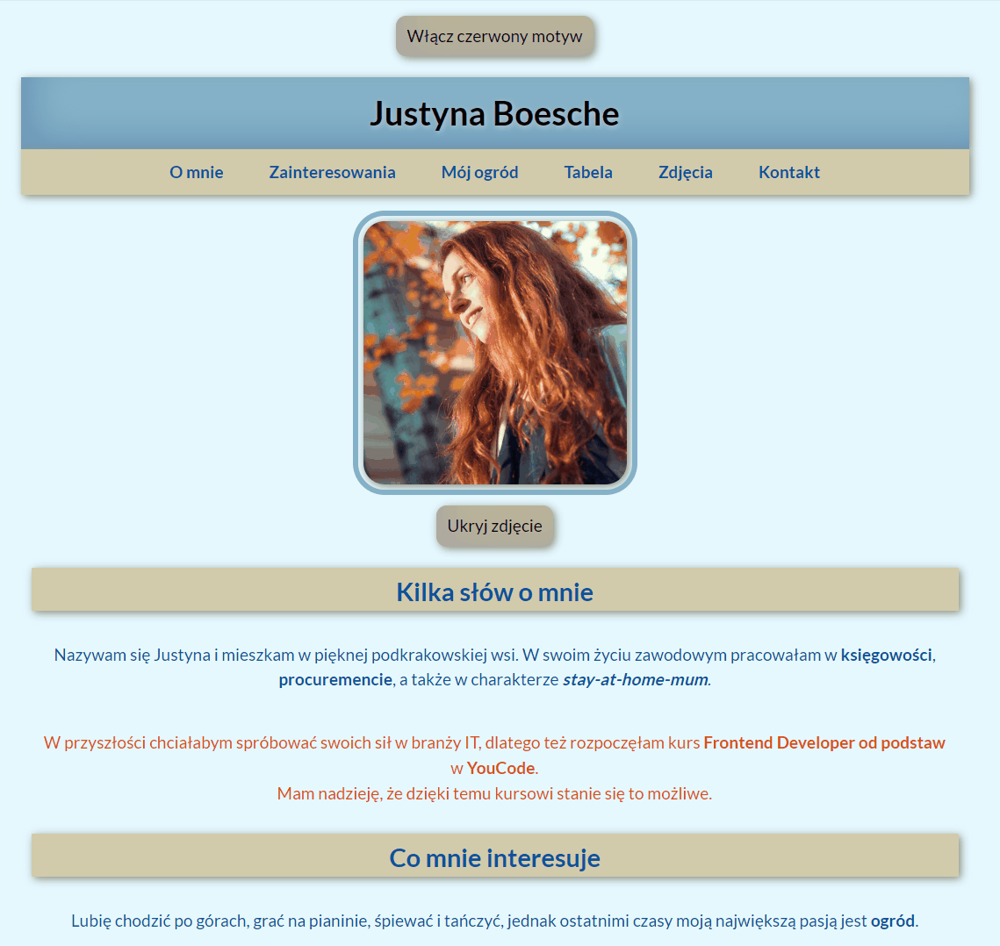

# Justyna Boesche - my very first Homepage

## Demo
[See my Homepage](https://justynaboesche.github.io/Homepage/)
## Description
This is my very first project created in the process of becoming the **Frontend Developer**. From my Homepage you can learn more about me, my professional experience, my interests and my plans for the future. In the footage, at the end of the page, you can find my contact details.
## How it works
As you can see, the application contains two interactions. The first interaction is able to change the blue mode into the red mode. The second interaction is responsible for removing and adding my photo. [Click here](https://justynaboesche.github.io/Homepage/) and have fun!

## Technologies used in the project
To create the application I have used:
- HTML
- CSS
- Normalize
- Flexbox
- BEM convention
- JavaScript
- ES6+ features
- GIT
- Markdown

